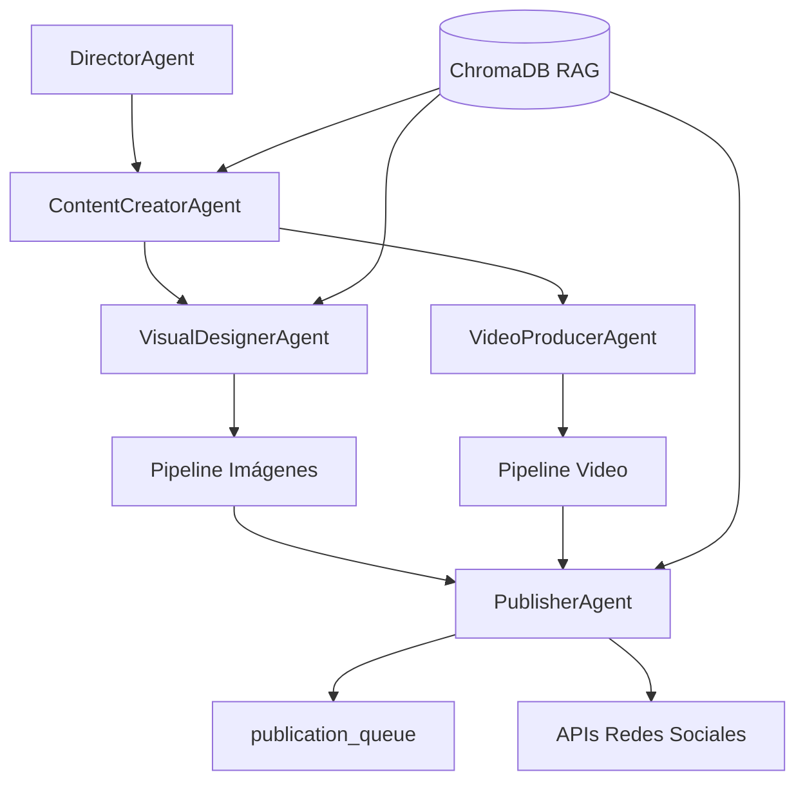

# motivacion-agentes

Sistema multi-agente en Python para generar contenido filosófico-motivacional en **español**, producir imágenes y videos listos para redes sociales, y organizarlos en paquetes por plataforma con publicación automática vía API y fallback manual.

## Arquitectura



### Agentes

| Agente | Responsabilidad |
|--------|-----------------|
| **DirectorAgent** | Temas, calendario, ID de contenido |
| **ContentCreatorAgent** | Mensaje, caption, hashtags (RAG: filosofía) |
| **VisualDesignerAgent** | Fondo, tipografía, composición (RAG: temas visuales) |
| **VideoProducerAgent** | Guion 20-40s, TTS, overlays |
| **PublisherAgent** | Empaqueta carpetas por plataforma + manifest/status |

## Requisitos

- Python 3.11+
- FFmpeg (incluido en Docker)
- Opcional: claves API (OpenAI, Pexels, Meta, etc.)

## Instalación local

```bash
git clone https://github.com/TU_USUARIO/motivacion-agentes.git
cd motivacion-agentes

python -m venv .venv
# Windows
.venv\Scripts\activate
# Linux/macOS
source .venv/bin/activate

pip install -r requirements.txt
cp .env.example .env
# Editar .env con tus API keys
```

## Modos de operación

| Modo | Variable | Descripción |
|------|----------|-------------|
| **Demo** | `DEMO_MODE=true` | Contenido de ejemplo, sin APIs |
| **Mock** | `MOCK_MODE=true` | Simula LLM cuando faltan claves OpenAI |
| **Producción** | Claves configuradas | Generación real con GPT-4o, Pexels, TTS |

Prueba rápida sin API keys:

```bash
python -m cli generate --demo
python -m cli status
```

## CLI

```bash
# Generar contenido completo
python -m cli generate
python -m cli generate --theme resiliencia
python -m cli generate --demo

# Ver cola de publicación
python -m cli status

# Publicar paquete (API + fallback manual)
python -m cli publish publication_queue/2026-06-08/msg_xxx_resiliencia_123456
python -m cli publish publication_queue/... -p instagram -p tiktok

# Scheduler diario (APScheduler)
python -m cli schedule

# Reintentar publicaciones pendientes
python scripts/publish_retry.py
```

## Docker

```bash
# Construir imagen
docker compose build

# Generación demo (sin APIs)
docker compose run --rm generate-demo

# Comandos CLI arbitrarios
docker compose run --rm motivacion-agentes generate --demo
docker compose run --rm motivacion-agentes status
docker compose run --rm motivacion-agentes publish publication_queue/FECHA/CONTENIDO_ID

# Scheduler en background
docker compose up -d scheduler
```

La imagen incluye **FFmpeg**, Python 3.11 y todas las dependencias. Los volúmenes montados persisten `publication_queue/` y `data/chroma/`.

## Variables de entorno

Copia `.env.example` a `.env`:

| Variable | Descripción |
|----------|-------------|
| `OPENAI_API_KEY` | GPT-4o, embeddings, TTS |
| `PEXELS_API_KEY` | Fondos foto/video |
| `ELEVENLABS_API_KEY` | TTS alternativo |
| `META_ACCESS_TOKEN` | Instagram/Facebook Graph API |
| `META_INSTAGRAM_ACCOUNT_ID` | ID cuenta Instagram Business |
| `DEMO_MODE` | `true` = modo offline |
| `MOCK_MODE` | `true` = fallback sin OpenAI |
| `SCHEDULE_HOUR` / `SCHEDULE_MINUTE` | Hora generación diaria |
| `TIMEZONE` | Zona horaria scheduler |

## Estructura de salida

```
publication_queue/
  2026-06-08/
    msg_20260608_resiliencia_143022/
      source/          # message.txt, script.txt, metadata.json
      instagram/       # feed.jpg, reel.mp4, caption.txt, hashtags.txt
      tiktok/
      facebook/
      youtube/
      twitter/
      manifest.json
      status.json      # pending | ready | published | manual | failed
```

## Publicación en redes

| Plataforma | Adaptador | Estado |
|------------|-----------|--------|
| Instagram/Facebook | Meta Graph API | Implementado con fallback manual |
| TikTok | Content Posting API | Stub |
| YouTube | Data API v3 | Stub |
| X/Twitter | API v2 | Stub |

Si la API falla, `status.json` pasa a `manual` y los archivos quedan listos para subida manual.

## Corpus RAG

Archivos en `rag/knowledge/`:

- `filosofia-es.md` — Estoicismo, temas, estilo de mensajes
- `temas-visuales.md` — Mapeo tema → fondos Pexels
- `brand-voice.md` — Tono de marca y captions
- `platforms-specs.yaml` — Specs técnicas por red

## Estructura del proyecto

```
motivacion-agentes/
├── agents/           # Agentes especializados
├── cli/              # Interfaz de línea de comandos
├── config/           # brand.yaml, platforms.yaml
├── graph/            # Orquestación LangGraph
├── pipelines/        # Imágenes (Pillow) y video (MoviePy/FFmpeg)
├── publishing/       # Adaptadores API por plataforma
├── rag/              # ChromaDB + knowledge base
├── scheduler/        # APScheduler
├── scripts/          # publish_retry.py
├── utils/            # Config, demo mode, media helpers
├── Dockerfile
├── docker-compose.yml
└── requirements.txt
```

## Costos estimados (APIs)

- OpenAI (contenido + embeddings): ~$15-40/mes
- ElevenLabs TTS: ~$5-22/mes
- Pexels: gratis
- APIs de redes: gratis (con aprobación)

## Publicar en GitHub

Si `gh` está autenticado:

```bash
gh auth login
gh repo create motivacion-agentes --public --source=. --remote=origin \
  --description "Sistema multi-agente de contenido motivacional en español" --push
```

Sin `gh`, crea el repositorio manualmente en GitHub y ejecuta:

```bash
git remote add origin https://github.com/TU_USUARIO/motivacion-agentes.git
git push -u origin main
```

## Licencia

MIT — Uso libre con atribución.

## Contribuir

1. Fork del repositorio
2. Rama feature (`git checkout -b feature/mi-mejora`)
3. Commit (`git commit -m 'Añade mejora X'`)
4. Push y Pull Request
