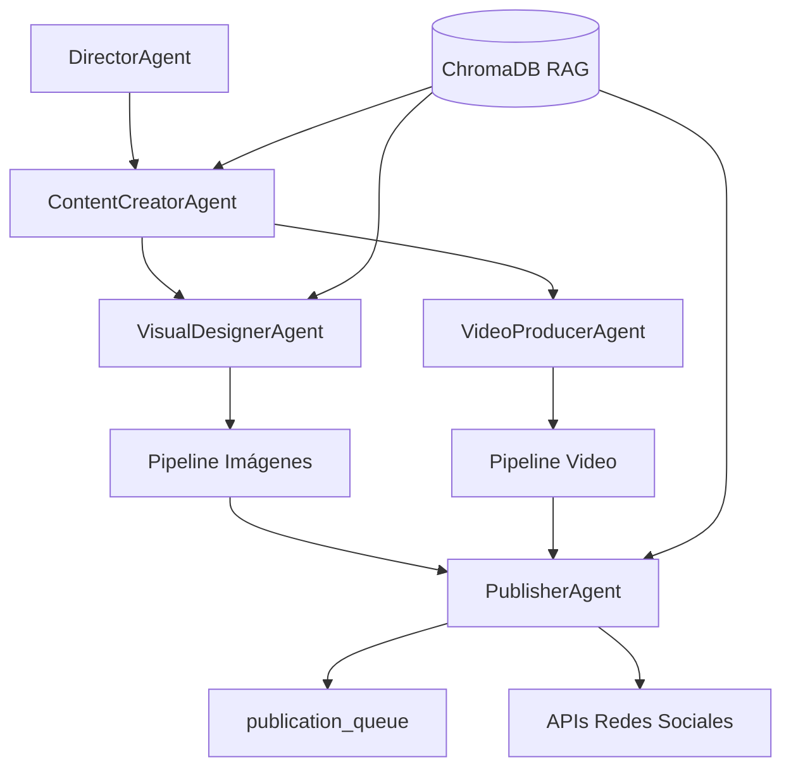

# motivacion-agentes

Sistema multi-agente en Python para generar contenido filosófico-motivacional en **español**, producir imágenes y videos listos para redes sociales, y organizarlos en paquetes por plataforma con publicación automática vía API y fallback manual.

## Arquitectura



### Agentes

| Agente | Responsabilidad |
|--------|-----------------|
| **DirectorAgent** | Temas, calendario, ID de contenido |
| **ContentCreatorAgent** | Mensaje, caption, hashtags (RAG: filosofía) |
| **VisualDesignerAgent** | Fondo, tipografía, composición (RAG: temas visuales) |
| **VideoProducerAgent** | Guion 20-40s, TTS, overlays |
| **PublisherAgent** | Empaqueta carpetas por plataforma + manifest/status |

## Requisitos

- Python 3.11+
- FFmpeg (incluido en Docker)
- Opcional: claves API (OpenAI, Pexels, Meta, etc.)

## Instalación local

```bash
git clone https://github.com/TU_USUARIO/motivacion-agentes.git
cd motivacion-agentes

python -m venv .venv
# Windows
.venv\Scripts\activate
# Linux/macOS
source .venv/bin/activate

pip install -r requirements.txt
cp .env.example .env
# Editar .env con tus API keys
```

## Modos de operación

| Modo | Variable | Descripción |
|------|----------|-------------|
| **Demo** | `DEMO_MODE=true` | Contenido de ejemplo, sin APIs |
| **Mock** | `MOCK_MODE=true` | Simula LLM cuando faltan claves OpenAI |
| **Producción** | Claves configuradas | Generación real con GPT-4o, Pexels, TTS |

Prueba rápida sin API keys:

```bash
python -m cli generate --demo
python -m cli status
```

## CLI

```bash
# Generar contenido completo
python -m cli generate
python -m cli generate --theme resiliencia
python -m cli generate --demo

# Ver cola de publicación
python -m cli status

# Publicar paquete (API + fallback manual)
python -m cli publish publication_queue/2026-06-08/msg_xxx_resiliencia_123456
python -m cli publish publication_queue/... -p instagram -p tiktok

# Scheduler diario (APScheduler)
python -m cli schedule

# Reintentar publicaciones pendientes
python scripts/publish_retry.py
```

## Tests

Suite con `pytest`. Los tests pesados (workflow completo, empaquetado) se omiten
automáticamente si faltan dependencias opcionales (`langgraph`, `Pillow`).

```bash
pip install -r requirements.txt
pytest
```

Cubren: modos de operación, selección de media host, transiciones de `status.json`,
fallback manual de los adaptadores sin credenciales, empaquetado y workflow demo.

## Panel web de administración

Interfaz web en español para administrar agentes, servicios, material generado y estadísticas.

```bash
# Levantar panel web (puerto 8080)
docker compose up -d web

# O en local (tras pip install -r requirements.txt)
python -m web
```

Abre **http://localhost:8080** en el navegador.

### Secciones del panel

| Sección | Funcionalidad |
|---------|---------------|
| **Inicio** | Resumen de paquetes, actividad reciente, estado de agentes |
| **Agentes** | Lista de 5 agentes, RAG, generar contenido, workflow completo, modo demo |
| **Servicios** | Salud de APIs (OpenAI, Pexels, Meta, etc.), scheduler, Docker |
| **Material generado** | Explorar `publication_queue`, previsualizar, descargar, publicar |
| **Estadísticas** | Métricas por plataforma, gráficos de tendencias (demo sin APIs) |

### API REST

| Método | Endpoint | Descripción |
|--------|----------|-------------|
| GET | `/api/dashboard/summary` | Resumen del dashboard |
| GET | `/api/agents` | Lista de agentes y tareas |
| POST | `/api/agents/generate` | Iniciar generación en background |
| POST | `/api/agents/workflow` | Ejecutar workflow completo |
| POST | `/api/agents/demo-mode` | Activar/desactivar modo demo |
| GET | `/api/services/health` | Estado de servicios y API keys |
| GET | `/api/content/packages` | Listar paquetes generados |
| GET | `/api/content/packages/{id}` | Detalle de un paquete |
| POST | `/api/content/packages/{id}/publish` | Publicar paquete |
| GET | `/api/content/packages/{id}/download` | Descargar ZIP del paquete |
| GET | `/api/analytics/platforms` | Métricas por plataforma |
| GET | `/api/analytics/trends` | Tendencias y gráficos |

## Docker

```bash
# Construir imagen
docker compose build

# Panel web + scheduler
docker compose up -d web scheduler

# Generación demo (sin APIs)
docker compose run --rm generate-demo

# Comandos CLI arbitrarios
docker compose run --rm motivacion-agentes generate --demo
docker compose run --rm motivacion-agentes status
docker compose run --rm motivacion-agentes publish publication_queue/FECHA/CONTENIDO_ID

# Scheduler en background (generación diaria)
docker compose up -d scheduler
```

La imagen incluye **FFmpeg**, Python 3.11 y todas las dependencias. Los volúmenes montados persisten `publication_queue/`, `data/chroma/` y `data/analytics/`.

## Variables de entorno

Copia `.env.example` a `.env`:

| Variable | Descripción |
|----------|-------------|
| `OPENAI_API_KEY` | GPT-4o, embeddings, TTS |
| `PEXELS_API_KEY` | Fondos foto/video |
| `ELEVENLABS_API_KEY` | TTS alternativo |
| `META_ACCESS_TOKEN` | Instagram/Facebook Graph API |
| `META_INSTAGRAM_ACCOUNT_ID` | ID cuenta Instagram Business |
| `DEMO_MODE` | `true` = modo offline |
| `MOCK_MODE` | `true` = fallback sin OpenAI |
| `SCHEDULE_HOUR` / `SCHEDULE_MINUTE` | Hora generación diaria |
| `TIMEZONE` | Zona horaria scheduler |

## Estructura de salida

```
publication_queue/
  2026-06-08/
    msg_20260608_resiliencia_143022/
      source/          # message.txt, script.txt, metadata.json
      instagram/       # feed.jpg, reel.mp4, caption.txt, hashtags.txt
      tiktok/
      facebook/
      youtube/
      twitter/
      manifest.json
      status.json      # pending | ready | published | manual | failed
```

## Publicación en redes

| Plataforma | Adaptador | Estado |
|------------|-----------|--------|
| Instagram | Meta Graph API (contenedor + publish) | Implementado (requiere media host) |
| Facebook | Graph API `/{page}/photos` | Implementado (requiere media host + Page ID) |
| TikTok | Content Posting API (init + upload) | Implementado (requiere app aprobada) |
| YouTube | Data API v3 (OAuth refresh + upload reanudable) | Implementado |
| X/Twitter | media v1.1 + tweets v2 (OAuth 1.0a) | Implementado |

Si la API falla o faltan credenciales, `status.json` pasa a `manual` y los archivos quedan listos para subida manual.

### Hosting de media (requisito para Instagram/Facebook)

La Graph API de Meta **no acepta subir bytes**: requiere una **URL pública** de la
imagen/video. Configura un proveedor con `MEDIA_HOST_PROVIDER`:

| Proveedor | Variable(s) | Notas |
|-----------|-------------|-------|
| `none` (default) | — | Sin hosting → publicación manual |
| `base_url` | `MEDIA_PUBLIC_BASE_URL` | Sirve `publication_queue/` estáticamente bajo esa URL |
| `s3` | `S3_BUCKET`, `AWS_ACCESS_KEY_ID`, `AWS_SECRET_ACCESS_KEY`, `S3_REGION` | Requiere `pip install boto3` |
| `cloudinary` | `CLOUDINARY_URL` | Requiere `pip install cloudinary` |

Las APIs basadas en subida directa de binario (TikTok, YouTube, X) **no** necesitan media host.

## Corpus RAG

Seis colecciones en `rag/knowledge/`, una por archivo. Cada agente consulta las
que necesita; los prompts incluyen los chunks recuperados como contexto.

| Colección | Archivo | Consumido por |
|-----------|---------|---------------|
| `filosofia` | `filosofia-es.md` | ContentCreator, VideoProducer |
| `brand` | `brand-voice.md` | ContentCreator |
| `visual` | `temas-visuales.md` | VisualDesigner |
| `guion` | `guion-video.md` | VideoProducer |
| `algoritmo` | `algoritmo-plataformas.md` | ContentCreator, Publisher |
| `platforms` | `platforms-specs.yaml` | Referencia técnica |

Los contenidos incluyen: tradiciones filosóficas múltiples (estoicismo, zen,
taoísmo, existencialismo, sabiduría iberoamericana), paletas HEX por tema,
plantillas de hooks/cierres, arquitectura narrativa para video corto y best
practices del algoritmo por plataforma (saves, shares, completion rate).

## Estructura del proyecto

```
motivacion-agentes/
├── agents/           # Agentes especializados
├── cli/              # Interfaz de línea de comandos
├── config/           # brand.yaml, platforms.yaml
├── graph/            # Orquestación LangGraph
├── pipelines/        # Imágenes (Pillow) y video (MoviePy/FFmpeg)
├── publishing/       # Adaptadores API por plataforma
├── rag/              # ChromaDB + knowledge base
├── scheduler/        # APScheduler
├── web/              # Panel FastAPI + dashboard
├── data/analytics/   # Snapshots de métricas
├── scripts/          # publish_retry.py
├── utils/            # Config, demo mode, media helpers
├── Dockerfile
├── docker-compose.yml
└── requirements.txt
```

## Costos estimados (APIs)

- OpenAI (contenido + embeddings): ~$15-40/mes
- ElevenLabs TTS: ~$5-22/mes
- Pexels: gratis
- APIs de redes: gratis (con aprobación)

## Publicar en GitHub

Si `gh` está autenticado:

```bash
gh auth login
gh repo create motivacion-agentes --public --source=. --remote=origin \
  --description "Sistema multi-agente de contenido motivacional en español" --push
```

Sin `gh`, crea el repositorio manualmente en GitHub y ejecuta:

```bash
git remote add origin https://github.com/TU_USUARIO/motivacion-agentes.git
git push -u origin main
```

## Licencia

MIT — Uso libre con atribución.

## Contribuir

1. Fork del repositorio
2. Rama feature (`git checkout -b feature/mi-mejora`)
3. Commit (`git commit -m 'Añade mejora X'`)
4. Push y Pull Request
